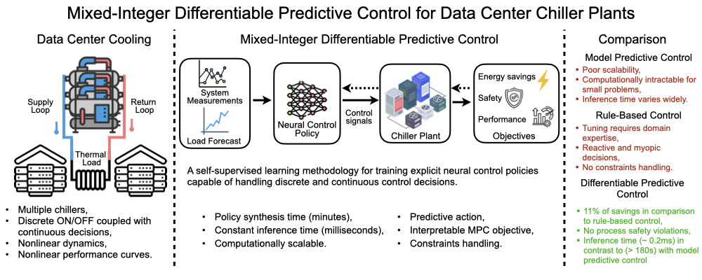
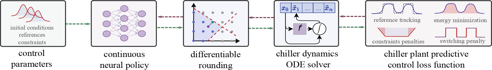
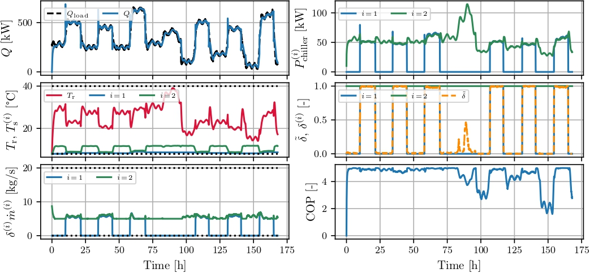
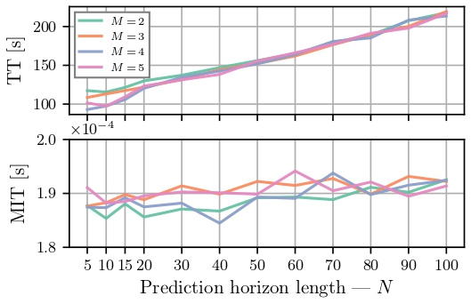
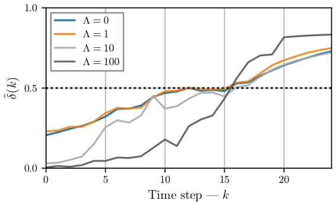

# Mixed-Integer Differentiable Predictive Control for Chiller Plant Optimization

This repository contains the implementation and experimental results for the paper: **"Mixed-Integer Differentiable Predictive Control for Chiller Systems"** (SSRN: https://papers.ssrn.com/sol3/papers.cfm?abstract_id=5764791).

## Overview

This repository implements **Mixed-Integer Differentiable Predictive Control (MIDPC)** for optimal control of multi-chiller plants. MIDPC embeds mixed-integers model predictive control principles within a deep learning framework. Thus, we are able to achieve energy-efficient chiller operation, satisfy cooling demand constraints, while perserving computational scalability. The approach is compared against the nominal **Mixed-Integer Model Predictive Control (MIMPC)** in terms of computational time and a **Rule-Based Control (RBC)** in terms of control performance.

The code models a chiller plant with multiple chillers ($M$) that must meet time-varying cooling loads while minimizing energy consumption. The control problem involves discrete decisions (chiller on/off status) ($\delta$) and continuous decisions (mass flow rates $\dot{m}$, evaporation temperatures ($T_\mathrm{e}$), making it a mixed-integer optimization problem. Morever, the optimal control problem at hand also features a bilinear dynamics and nonlinear performance scores; implemented as equality constraints.

## Graphical abstract


## Mixed-Integer Differentiable Predictive Control
The methodology that enables the DPC to handle mixed-integer decision variables is described in **"Learning to Solve Parametric Mixed-Integer Optimal Control Problems via Differentiable Predictive Control"** paper, available at (https://arxiv.org/abs/2506.19646)

<div style="text-align:center;">
  <span style="background:white; padding:8px; display:inline-block;">
    
  </span>
</div>

## Repository Structure

```
MI-DPC/
├── MIDPC.py                          # MIDPC policy training and inference module (neuromancer)
├── MIMPC.py                          # Mixed-Integer MPC implementation (pyomo)
├── RBC.py                            # Rule-Based Control implementation (torch)
├── chiller_system.py                 # multi-chiller plant dynamics model
├── simulate_chiller.py               # Simulation framework for evaluating all controllers (MIDPC, MIMPC, RBC)
├── analysis.py                       # Performance analysis and plotting
├── utils.py                          # Utilities (plotting, thermal load data generation, custom MLP class)
├── init.py                           # Chiller system parameters and configuration
├── MIDPC_BVR_experiment.py           # Binary-variance regularization experiments
├── run_training.sh                   # Batch training script for training MIDPC policies (runs MIDPC.py)
├── run_simulation.sh                 # Batch simulation script for all controllers (runs simulate_chiller.py)
├── chiller_staging_with_ramp_limits/ # Experiments with ramp limits on delivered cooling
├── results/                          # Trained models and simulation results
│   ├── MIDPC/                        # MIDPC trained policies and simulation data
│   ├── MIMPC/                        # MIMPC simulation results
│   └── RBC/                          # RBC simulation results
├── plots/                            # Generated figures and visualizations
└── logs/                             # Training and simulation logs
```

**Note:** The `chiller_staging_with_ramp_limits/` directory contains the same experimental setup as the main repository, with the addition of ramp rate constraints on the delivered cooling. This variant explores the impact of rate-of-change limitations on cooling delivery. This part of implementation is still in development.

## Major Files

### Core Control Implementations

- **`MIDPC.py`**: MIDPC policy implementation with training loop, and inference interface.
- **`MIMPC.py`**: Mixed-Integer MPC baseline using Pyomo with gurobi solver for mixed-integer optimization.
- **`RBC.py`**: Rule-Based Control baseline with threshold-based chiller staging.

### System Modeling

- **`chiller_system.py`**: Physics-based chiller dynamics including thermal models, power consumption, and cooling delivery calculations.
- **`init.py`**: System parameters, physical constants, and operating bounds.

### Simulation and Analysis

- **`simulate_chiller.py`**: Closed-loop simulation framework for evaluating control policies.
- **`analysis.py`**: Performance evaluation, metrics computation, and visualization generation.

### Utilities

- **`utils.py`**: Custom MLP implementation, load signal generation, and plotting utilities.
- **`MIDPC_BVR_experiment.py`**: Binary variable regularization experiments.

### Scripts

- **`run_training.sh`**: Batch training script for multiple configurations.
- **`run_simulation.sh`**: Batch simulation script for all control policies.

## Key Results
The following figures illustrate the main results:

### Control Trajectory 
Closed-loop simulation results of a two-chiller system obtained with MI-DPC for a prediction horizon of $N = 15$.
<div style="text-align:center;">
  <span style="background:white; padding:8px; display:inline-block;">
    
  </span>
</div>

### Inference Time Analysis of MIDPC
Mean inference time (MIT) and training time (TT) as a function of prediction horizon length ($N$) for different numbers of chillers ($M$) with Mixed-Integer Differentiable Predictive Control. The plot indicates an approximate linear trend of problem size and computational complexity.
<div style="text-align:center;">
  <span style="background:white; padding:8px; display:inline-block;">
    
  </span>
</div>


### The impact of Binary-Variance Regularization on relaxed integer variable
This plot shows how scaling up the magnitude of binary-variance regularization ($\Lambda$) affects the relaxed integer variable ($\tilde\delta$). With higher magnitudes the regularization penalizes low confidence of the binary value, i.e., values near rounding threshold $0.5$; $\tilde\delta = 0.5$.
<div style="text-align:center;">
  <span style="background:white; padding:8px; display:inline-block;">
    
  </span>
</div>


## Usage

### Training MIDPC Policies

```bash
python MIDPC.py -nsteps 15 -Ts 180 -M 2
```

Parameters:
- `-nsteps`: Prediction horizon length (N)
- `-Ts`: Sampling time in seconds (default: 180)
- `-M`: Number of chillers (default: 2)

### Running Simulations

```bash
python simulate_chiller.py -policy MIDPC -nsteps 15 -Ts 180 -M 2 -n_days 7
```

Parameters:
- `-policy`: Control strategy (`MIDPC`, `MIMPC`, or `RBC`)
- `-nsteps`: Prediction horizon (for MIDPC/MIMPC)
- `-Ts`: Sampling time in seconds
- `-M`: Number of chillers
- `-n_days`: Simulation duration in days


## Key Features of MIDPC for chiller plant optimization

- **Physics-Informed Policy Learning**: Incorporates system dynamics directly into the optimal control problem
- **Mixed-Integer Control**: Handles discrete (chiller on/off) and continuous (flow rates, temperatures) decisions
- **Scalability**: Linear scaling of training time and inference time with respect to number of chillers and prediction horizon length
- **Fast Inference**: Sub-millisecond inference times, suitable for real-time control
- **Energy Efficiency**: Optimizes chiller and pump power consumption while satisfying cooling demand

## Dependencies

- PyTorch
- NeuroMancer
- Pyomo (for MIMPC optimization)
- Gurobi or SCIP (for MIMPC solver)
- NumPy, Matplotlib
- Pandas, Tabulate (for analysis)

## Citations

If you use this code in your research, please cite:

```
[Paper citation will be added upon publication]
SSRN: https://papers.ssrn.com/sol3/papers.cfm?abstract_id=5764791
```

If you use Mixed-Integer Differentiable Predictive Control methodology, please cite:
```
[Paper citation will be added upon publication]
https://arxiv.org/abs/2506.19646
```